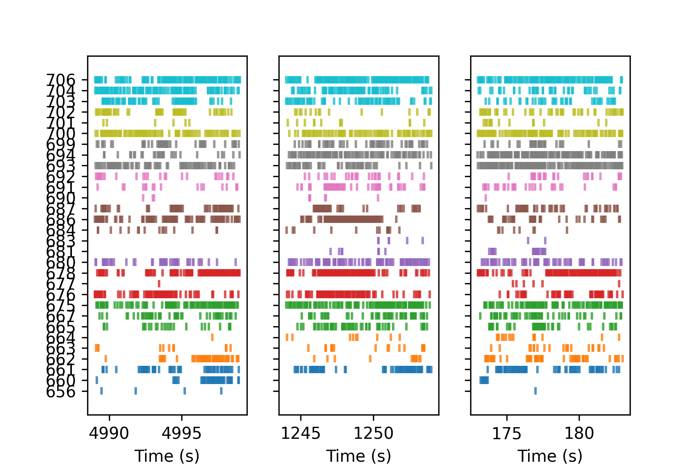
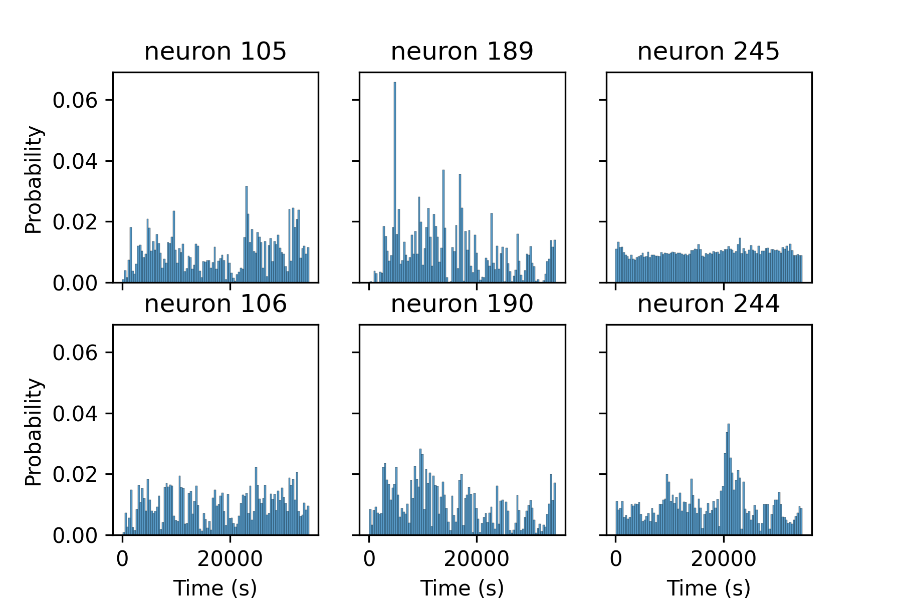

# ks3-to-otherformat
converting kilosort3 + phy2 sorted neural data into other readable formats


## install
```angular2html
git clone https://github.com/runninghsus/ks3-to-otherformat.git
```

## create env with dependencies

### macOS
```angular2html
cd ks3-to-other
conda env create -f env.yaml
conda activate ks3-to-other
```

### win10/11


## run app
```angular2html
streamlit run main.py
```


### Once you saved the csv files, you can run post-hoc plots using jupyter-lab
in another prompt
```angular2html
jupyter-lab notebooks/
```


#### rasters to examine different time points in recording


#### neural activity distribution over the course of recording

